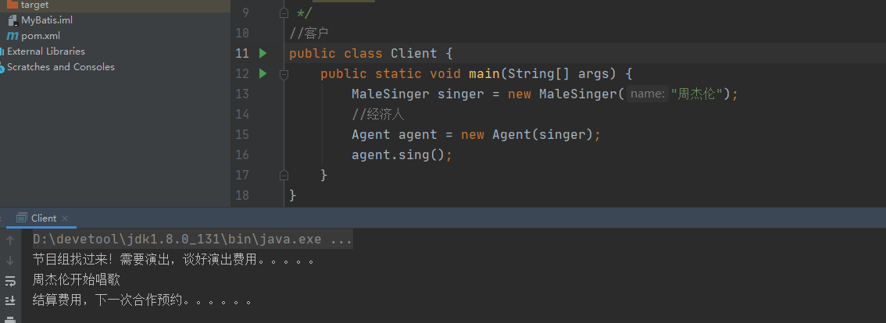
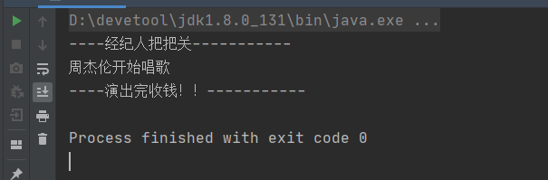
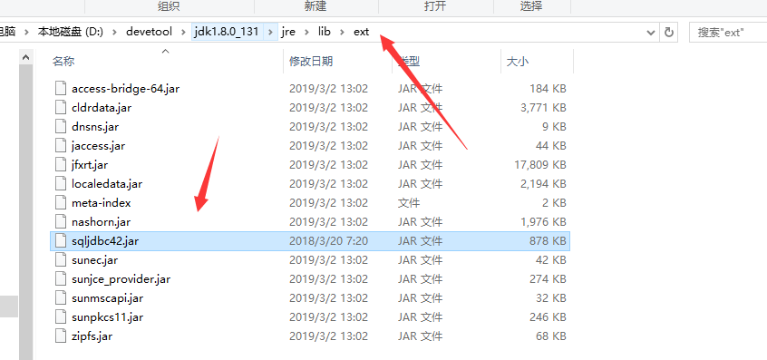
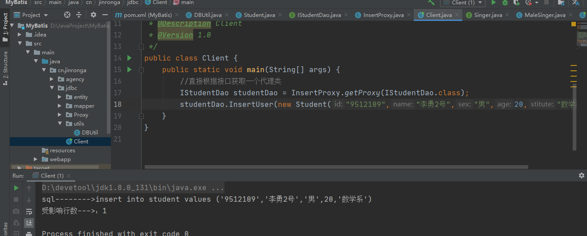

#### 一、了解MyBatis：

1、MyBatis 是一款优秀的持久层框架，它支持自定义 SQL、存储过程以及高级映射。MyBatis 免除了几乎所有的 JDBC 代码以及设置参数和获取结果集的工作。MyBatis 可以通过简单的 XML 或注解来配置和映射原始类型、接口和 Java POJO（Plain Old Java Objects，普通老式 Java 对象）为数据库中的记录。


MyBatisPlus：（中国人开发）


**2、作用 （百度百科）** 

MyBatis 是一款优秀的持久层框架，它支持定制化 SQL、存储过程以及高级映射**。 MyBatis 避免了几乎所有的 JDBC 代码和手动设置参数以及获取结果集。** MyBatis 可以使用简单的 XML 或注解来配置和映射原生信息，将接口和 Java 的 POJOs(Plain Ordinary Java Object,普通的 Java对象)映射成数据库中的记录。

**3、说说持久化 （将内存的数据永久保存到磁盘硬盘中）**

持久化就是把数据存在磁盘而不是内存。

1. 程序产生的数据首先都是在内存。 
2.  内存是不可靠的，他丫的一断电数据就没了。

3. 那可靠的存储地方是哪里，硬盘、U盘、光盘等。 4. 我们的程序在运行时说的持久化通常就是指将内存的数据存在硬盘。 5. 硬盘用哪些地方能存？数据库文件、xml文件、反正你将来能将数据读出来的文件都行。

**4、什么是持久层**

- 业务是需要操作数据的 
- 数据是在磁盘上的
-  具体业务调用具体的数据库操作，耦合度太高，复用性太差 
- 将操作数据库的代码统一抽离出来，自然就形成了介于业务层和数据库中间的独立的层

**5、mybatis的优点和缺点**

优点：便于维护管理，不用在java代码中找这些语句； 

缺点： JDBC方式可以用打断点的方式调试，但是Mybatis不能，需要通过log4j日志输出日志信息帮助调试， 然后在配置文件中修改

用逻辑标签控制动态SQL的拼接：

**优点：**用标签代替编写逻辑代码； 

**缺点：**拼接复杂SQL语句时，没有代码灵活，拼写比较复杂。不要使用变通的手段来应对这种复杂的语句。

查询的结果集与java对象**自动映射**：

 **优点：**保证名称相同，配置好映射关系即可自动映射或者，不配置映射关系，通过配置列名=字段名也可完成 自动映射。

**缺点：**对开发人员所写的SQL依赖很强。

编写原生SQL： 

**优点：**接近JDBC，比较灵活。 

**缺点：**对SQL语句依赖程度很高；并且属于半自动，数据库移植比较麻烦，比如mysql数据库编程Oracle数据 库，部分的sql语句需要调整。

 最重要的一点，使用的人多！公司需要！但是应为用了反射，效率会下降，所有有些公司会使用原生的jdbc

**6、体验代理设计模式**

>代理模式分为静态代理和动态代理。代理的核心功能是方法增强

（1）静态代理 静态代理角色分析 

抽象角色 : 一般使用接口或者抽象类来实现 真实角色 : 被代理的角色 

代理角色 : 代理真实角色 ; 代理真实角色后 , 一般会做一些附属的操作 . 

客户 : 使用代理角色来进行一些操作

代码案例：

**静态代理：**

抽象角色 : 写一个接口 interface

```java
public interface Singer {
    /**
     * 唱歌
     */
    void sing();
}
```

具体的角色：歌手

```java
//歌手
public class MaleSinger implements Singer{
    private String name;

    public MaleSinger(String name) {
        this.name = name;
    }

    @Override
    public void sing() {
        System.out.println(name+"开始唱歌");
    }
}
```

代理角色 :定义经纪人

```java
//歌手经理人
public class Agent implements Singer{
    private Singer singer;

    public Agent(Singer singer) {
        this.singer = singer;
    }

    @Override
    public void sing() {
        System.out.println("节目组找过来！需要演出，谈好演出费用。。。。。");
        singer.sing();
        System.out.println("结算费用，下一次合作预约。。。。。。");
    }
}
```

客户:Client : 即客户

```java
//客户
public class Client {
    public static void main(String[] args) {
        MaleSinger singer = new MaleSinger("周杰伦");
        //经济人
        Agent agent = new Agent(singer);
        agent.sing();
    }
}
```




分析：在这个过程中，如果你要请周杰伦开演唱会、你直接接触的就是周杰伦的经济人，经纪人在周杰伦演出的前后跑前跑后发挥了巨大的作用。

**优点：**

周杰伦还是周杰伦经纪人，没有必要为了一下前置后置工作改变鹿晗这个类 公共的统一问题交给代理处理 公共业务进行扩展或变更时，可以更加方便 这不就是更加符合开闭原则，单一原则吗?

**缺点：**

每一个被代理类都需要写个代理类，非常造成文件非常多麻烦

**（2）动态代理** 

- 动态代理的角色和静态代理的一样 . 
- 动态代理的代理类是动态生成的 . 静态代理的代理类是我们提前写好的 
- 动态代理分为两类 : 一类是基于接口动态代理 , 一类是基于类的动态代理 

1. 基于接口的动态代理----JDK动态代理 
2. 基于类的动态代理--cglib（有兴趣自己研究）
3.  现在用的比较多的是 javasist 来生成动态代理 . 百度一下javasist 我们这里使用JDK的原生代码来实现，其余的道理都是一样的！

**JDK的动态代理需要了解两个类**

核心 : InvocationHandler 和 Proxy

【InvocationHandler：调用处理程序】

```java
Object invoke(Object proxy, 方法 method, Object[] args)；
//参数
//proxy - 调用该方法的代理实例
//method -所述方法对应于调用代理实例上的接口方法的实例。方法对象的声明类将是该方法声明的接口，它可以是
代理类继承该方法的代理接口的超级接口。
//args -包含的方法调用传递代理实例的参数值的对象的阵列，或null如果接口方法没有参数。原始类型的参数包含
在适当的原始包装器类的实例中，例如java.lang.Integer或java.lang.Boolean
```

【Proxy : 代理】

```java
//生成代理类
public Object getProxy(){
return Proxy.newProxyInstance(this.getClass().getClassLoader(),
rent.getClass().getInterfaces(),this);
}
```

**动态代理代码实现**

抽象角色和真实角色和之前的一样！ 还是抽象角色和男歌星 

Agent. java 即经纪人

```java
public class Agent implements InvocationHandler {
    private Singer singer;

    public void setSinger(Singer singer) {
        this.singer = singer;
    }

    @Override
    public Object invoke(Object proxy, Method method, Object[] args) throws Throwable {
        System.out.println("----经纪人把把关-----------");
        /**
         * 设置代理对象
         */
        Object invoke = method.invoke(singer, args);
        System.out.println("----演出完收钱！！-----------");
        return invoke;
    }

    /**
     * 获取一个代理类对象
     */
    public Object getProxy() {
        return Proxy.newProxyInstance(this.getClass().getClassLoader(),
                new Class[]{Singer.class},this);
    }
}
```

 Client：

```java
public class Client {
    public static void main(String[] args) {
        MaleSinger maleSinger = new MaleSinger("周杰伦");
        Agent1 agent1 = new Agent1();
        agent1.setSinger(maleSinger);
        Singer singer = (Singer) agent1.getProxy();

        singer.sing();
    }
}
```



思考那我们其他所有的类是不是都可以了？

咱们的Mapper，service的类是不是都能代理了，批量去给这些方法加一些日志之类的是不是就可以了，或者统一加上 开启事务，关系事务等。


接下来用上面的思想做个案例

下面是使用JDBC知识整合的Demo

思考：只有接口的Mapper 还是要传入一个代理对象，那么我们能不能直接根据接口生成个代理啊！

> 能！

配置：

```xml
 <dependency>
      <groupId>com.microsoft.sqlserver</groupId>
      <artifactId>sqljdbc4</artifactId>
      <version>4.0</version>
    </dependency>
    <!-- https://mvnrepository.com/artifact/org.lwjgl/lwjgl-odbc -->
    <dependency>
      <groupId>org.lwjgl</groupId>
      <artifactId>lwjgl-odbc</artifactId>
      <version>3.2.3</version>
    </dependency>
    <dependency>
      <groupId>org.projectlombok</groupId>
      <artifactId>lombok</artifactId>
      <version>1.18.10</version>
    </dependency>
```

学习Lombok：https://www.cnblogs.com/jinronga/p/12753842.html  一个强大让人偷懒的插件

sql:

```sql
GO
CREATE TABLE [dbo].[Student](
	[id] [varchar](500) NOT NULL,
	[name] [varchar](500) NULL,
	[sex] [varchar](2) NULL DEFAULT ('男'),
	[age] [int] NULL,
	[stitute] [varchar](500) NULL,
 CONSTRAINT [PK_xuehao] PRIMARY KEY CLUSTERED 
(
	[id] ASC
)WITH (PAD_INDEX = OFF, STATISTICS_NORECOMPUTE = OFF, IGNORE_DUP_KEY = OFF, ALLOW_ROW_LOCKS = ON, ALLOW_PAGE_LOCKS = ON) ON [PRIMARY]
) ON [PRIMARY]

GO

SET ANSI_PADDING OFF
GO

ALTER TABLE [dbo].[Student]  WITH CHECK ADD CHECK  (([sex]='女' OR [sex]='男'))
GO
```

下载：https://www.microsoft.com/zh-cn/download/details.aspx?id=11774

得到sqljdbc42.jar 放到jdk目录ext，



开始撸代码！


数据库连接工具类：这里是连接sqlserver2012数据库

```java

/**
 * 数据库连接工具类
 */
public class DBUtil {
    public static Connection getConnection() {
        String url = "jdbc:sqlserver://192.168.112.115:1433;DatabaseName=test";
        String user = "sa";
        String password = "123456";
        String driverName = "com.microsoft.sqlserver.jdbc.SQLServerDriver";
        Connection conn = null;
        try {
            Class clazz = Class.forName(driverName);
            Driver driver = (Driver) clazz.newInstance();
//3.注册驱动
            DriverManager.registerDriver(driver);
//4.获取连接
            conn = DriverManager.getConnection(url, user, password);

        } catch (Exception e) {
            e.printStackTrace();
        }
        return conn;
    }

    public static void closeAll(Connection connection, Statement statement, ResultSet
            rs) {
        if (connection != null) {
            try {
                connection.close();
            } catch (SQLException e) {
                e.printStackTrace();
            }
        }
        if (statement != null) {
            try {
                statement.close();
            } catch (SQLException e) {
                e.printStackTrace();
            }
        }
        if (rs != null) {
            try {
                rs.close();
            } catch (SQLException e) {
                e.printStackTrace();
            }
        }
    }
}
```

实体类：

```java
@Data
@NoArgsConstructor                 //无参构造  Lombok特性
@AllArgsConstructor   //有参构造  Lombok特性
public class Student {
    private String id;
    private String name;
    private String sex;
    private int age;
    private String stitute;
}
```

StudentMapper接口：

```java
public interface IStudentDao {
    /**
     * 添加学生
     *
     * @param student
     */
    void InsertUser(Student student);
}

```

**全国统一的插入代理**

这个代理能针对所有的实体类（实体类和表名一致，字段名一致）生成对应的sql并形成代理。 **简单感受即可**，此代理功能简单不严谨。

```java
//全国统一的插入代理
public class InsertProxy implements InvocationHandler {
    @Override
    public Object invoke(Object proxy, Method method, Object[] args) throws Throwable {
        //使用参数（就用第一个）实体类拼装sql（insert）
        StringBuilder sql = new StringBuilder("insert into ");
        sql.append(args[0].getClass().getSimpleName().toLowerCase())
                .append(" values (");
        Field[] fields = args[0].getClass().getDeclaredFields();
        for (Field field : fields) {
            field.setAccessible(true);
            if (field.getType() == int.class) {
                try {
                    sql.append(field.getInt(args[0])).append(",");
                } catch (IllegalAccessException e) {
                    e.printStackTrace();
                }
            } else if (field.getType() == String.class) {
                try {
                    sql.append("'").append(field.get(args[0])).append("',");
                } catch (IllegalAccessException e) {
                    e.printStackTrace();
                }
            }
        }

        //执行sql
        Connection connection = null;
        PreparedStatement preparedStatement = null;
        int rows = 0;
        try {
            connection = DBUtil.getConnection();
            sql.deleteCharAt(sql.length() - 1).append(")");
            preparedStatement = connection.prepareStatement(sql.toString());
            rows = preparedStatement.executeUpdate();
        } catch (SQLException e) {
            e.printStackTrace();
        } finally {
            DBUtil.closeAll(connection, preparedStatement, null);
        }
        System.out.println("sql-------->" + sql);
        System.out.println("受影响行数--->：" + rows);
        return rows;
    }

    /**
     * 获取一个代理对象
     *
     * @return
     */
    public static <T> T getProxy(Class<T> tClass) {
        InsertProxy insertProxy = new InsertProxy();
        return (T) Proxy.newProxyInstance(insertProxy.getClass().getClassLoader(),
                new Class[]{tClass}, insertProxy);
    }
}
```

以后有插入需求，只需要写个接口生成代理即可，

测试:

```java
public class Client {
    public static void main(String[] args) {
        //直接根据接口获取一个代理类
        IStudentDao studentDao = InsertProxy.getProxy(IStudentDao.class);
        studentDao.InsertUser(new Student("9512109","李勇2号","男",20,"数学系"));
    }
}
```



六六六！！！


思考：

思比如有一个Admin的实体类和dao接口是不是也能进行插入啊

> 能


Mybatis增删改查：下一章