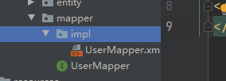
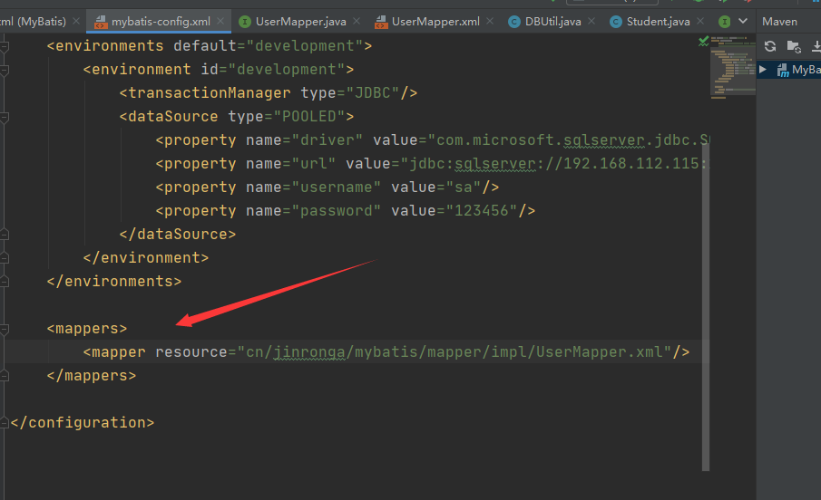
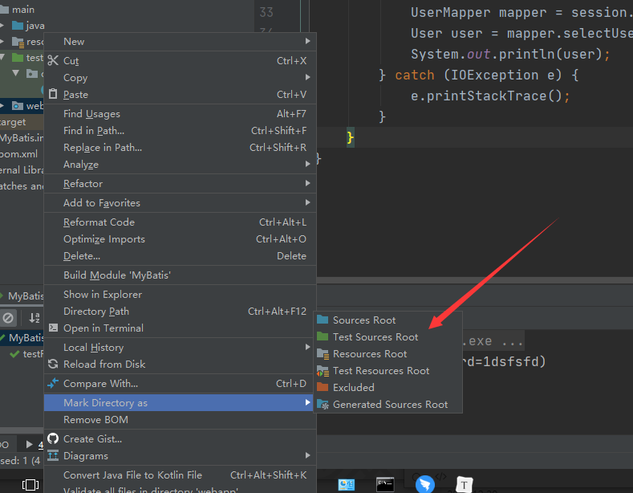
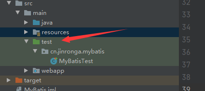
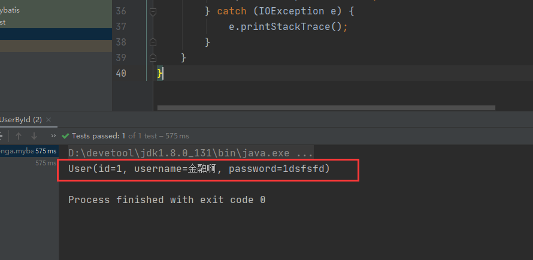
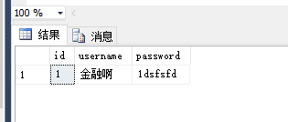
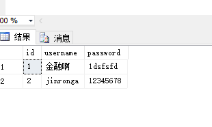
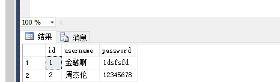
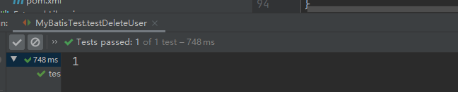
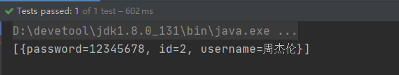

### MyBatisCRUD来一套：

1、建立数据库：

```sql
CREATE TABLE [dbo].[user](
	[id] [int] NOT NULL,
	[username] [varchar](50) NULL,
	[password] [varchar](50) NULL,
 CONSTRAINT [PK_user] PRIMARY KEY CLUSTERED 
(
	[id] ASC
)WITH (PAD_INDEX = OFF, STATISTICS_NORECOMPUTE = OFF, IGNORE_DUP_KEY = OFF, ALLOW_ROW_LOCKS = ON, ALLOW_PAGE_LOCKS = ON) ON [PRIMARY]
) ON [PRIMARY]
```

2、编写实体类

上一章写了lombok说明

```java
@Data
@AllArgsConstructor
@NoArgsConstructor
public class User {
    private int id;
    private String username;
    private String password;
}
```

3、maven配置

```xml
<dependencies>
    <!-- 单元测试 -->
    <dependency>
        <groupId>junit</groupId>
        <artifactId>junit</artifactId>
        <version>4.11</version>
        <scope>test</scope>
    </dependency>
    <!--    连接sqlserver驱动-->
    <dependency>
        <groupId>com.microsoft.sqlserver</groupId>
        <artifactId>sqljdbc4</artifactId>
        <version>4.0</version>
    </dependency>
    <!-- https://mvnrepository.com/artifact/org.lwjgl/lwjgl-odbc -->
    <dependency>
        <groupId>org.lwjgl</groupId>
        <artifactId>lwjgl-odbc</artifactId>
        <version>3.2.3</version>
    </dependency>
    <dependency>
        <groupId>org.projectlombok</groupId>
        <artifactId>lombok</artifactId>
        <version>1.18.10</version>
    </dependency>
    <!-- mybatis 核心 -->
    <dependency>
        <groupId>org.mybatis</groupId>
        <artifactId>mybatis</artifactId>
        <version>3.5.2</version>
    </dependency>
</dependencies>

<!-- 处理资源被过滤问题 -->
<build>
    <plugins>
        <plugin>
            <groupId>org.apache.maven.plugins</groupId>
            <artifactId>maven-compiler-plugin</artifactId>
            <version>3.1</version>
            <configuration>
                <source>1.8</source> <!-- 源代码使用的JDK版本 -->
                <target>1.8</target> <!-- 需要生成的目标class文件的编译版本 -->
                <encoding>UTF-8</encoding><!-- 字符集编码 -->
            </configuration>
        </plugin>
    </plugins>
    <resources>
        <resource>
            <directory>src/main/java</directory>
            <includes>
                <include>**/*.properties</include>
                <include>**/*.xml</include>
            </includes>
            <filtering>false</filtering>
        </resource>
        <resource>
            <directory>src/main/resources</directory>
            <includes>
                <include>**/*.properties</include>
                <include>**/*.xml</include>
            </includes>
            <filtering>false</filtering>
        </resource>
    </resources>
</build>
```

4、编写MyBatis核心配置文件，mybatis-config.xml

```xml
<?xml version="1.0" encoding="UTF-8" ?>
<!DOCTYPE configuration
        PUBLIC "-//mybatis.org//DTD Config 3.0//EN"
        "http://mybatis.org/dtd/mybatis-3-config.dtd">

<configuration>
    <environments default="development">
        <environment id="development">
            <transactionManager type="JDBC"/>
            <dataSource type="POOLED">
                <property name="driver" value="com.microsoft.sqlserver.jdbc.SQLServerDriver"/>
                <property name="url" value="jdbc:sqlserver://192.168.112.115:1433;DatabaseName=test"/>
                <property name="username" value="sa"/>
                <property name="password" value="123456"/>
            </dataSource>
        </environment>
    </environments>
</configuration>
```

三、CRUD

说明：

第一次使用mybatis，要注意mybatis，需要两个文件

-  一个接口类mapper（就是咱们写的dao）java文件，不需要有实现 一个与接口对应的xml文件
-  两个文件名字最好一样，比如一个UserMapper.java一个UserMapper.xml 
- 框架要根据mapper和xml联合，形成代理对象

> xxxMapper基本格式



UserMapper.xml

```xml
<?xml version="1.0" encoding="UTF-8" ?>
<!DOCTYPE mapper
        PUBLIC "-//mybatis.org//DTD Mapper 3.0//EN"
        "http://mybatis.org/dtd/mybatis-3-mapper.dtd">
<mapper namespace="cn.jinronga.mybatis.mapper.UserMapper">
    <select id="selectUser" resultType="cn.jinronga.mybatis.entity.User">
select id,username,password from [user]
</select>
</mapper>
```

UserMapper.xml需要在mybatis-config.xml注册：

```xml
<mappers>
    <mapper resource="cn/jinronga/mybatis/mapper/impl/UserMapper.xml"/>
</mappers>
```




简单理解namespace就是 维护mapper的对应关系

配置文件中namespace中的名称为对应Mapper接口或者Dao接口的完整包名,叫mapper或dao无所谓，但名字必 须一致！

**1、select（查询）**

select标签是mybatis中最常用的标签

1、在UserMapper中添加对应方法

```java
public interface UserMapper {
    //根据id查询用户
    User selectUserById(int id);
}
```

2、在UserMapper.xml中添加Select语句

```xml
</select>
    <select id="selectUserById" resultType="cn.jinronga.mybatis.entity.User" parameterType="int">
select id,username,password from [user] where id = #{id}
</select>
```

解释：

- resultType：制定返回类型，查询是有结果的，结果啥类型，你得告诉我 
- parameterType：参数类型，查询是有参数的，参数啥类型，你得告诉我 
- id：制定对应的方法（UserMapper中的方法），就是你的告诉我你这sql对应的是哪个方法 
- #{id}：sql中的变量，要保证大括号的变量必须在User对象里有， 当然你可以使用map，这或啥也能干，这要你将来传进的map有id这个key就行
-  #{}：占位符，其实就是咱们的【PreparedStatement】处理这个变量

还有：除了#{}还有${}，看看有啥区别。

- \#{} 的作用主要是替换预编译语句(PrepareStatement)中的占位符? 【推荐使用防止sql注入】

```sql
INSERT INTO [user] (username) VALUES (#{username});
INSERT INTO [user] (username) VALUES (?);
```

- ${} 的作用是直接进行字符串替换【不安全sql注入风险 】

```sql
INSERT INTO [user] (username) VALUES ('${username}');
INSERT INTO [user] (username) VALUES ('金融融融融果果');
```

测试：

先往user表插入一条数据

```sql
  insert into [dbo].[user] ([id]
      ,[username]
      ,[password]) values(1,'金融啊','1dsfsfd');
```

新建test文件夹：

右击文件夹：选择



变成：



```java
public class MyBatisTest {
    @Test
    public void testFindUserById() {
        try {
            String resource = "mybatis-config.xml";
            //输入流获取配置文件
            InputStream inputStream = Resources.getResourceAsStream(resource);
            /**
             * SqlSessionFactory是MyBatis的关键对象,它是个单个数据库映射关系经过编译后的内存镜像
             * .SqlSessionFactory对象的实例可以通过SqlSessionFactoryBuilder对象类获得,
             * 而SqlSessionFactoryBuilder则可以从XML配置文件或一个预先定制的Configuration
             * 的实例构建出SqlSessionFactory的实例.每一个MyBatis的应用程序都以一个SqlSessionFactory对象的实例为核心.
             * 同时SqlSessionFactory也是线程安全的,SqlSessionFactory一旦被创建,
             * 应该在应用执行期间都存在.在应用运行期间不要重复创建多次,建议使用单例模式.SqlSessionFactory是创建SqlSession的工厂.
             */
            SqlSessionFactory sqlSessionFactory = new
                    SqlSessionFactoryBuilder().build(inputStream);
            SqlSession session = sqlSessionFactory.openSession();
            //获取UserMapper接口
            UserMapper mapper = session.getMapper(UserMapper.class);
            //执行通过id查询方法
            User user = mapper.selectUserById(1);
            System.out.println(user);
        } catch (IOException e) {
            e.printStackTrace();
        }
    }
}
```

结果：



抽取公共的读取文件方法：

```java
private SqlSession session;

@Before
public void before() {
    try {
        String resource = "mybatis-config.xml";
        InputStream inputStream = Resources.getResourceAsStream(resource);
        SqlSessionFactory sqlSessionFactory = new
                SqlSessionFactoryBuilder().build(inputStream);
        session = sqlSessionFactory.openSession();
    } catch (IOException e) {
        e.printStackTrace();
    }
}
```

2、insert（插入）

insert标签被用作插入操作

1、UserMapper接口添加方法

```java
 //新增user
    int addUser(User user);
```

2、在UserMapper.xml中添加Insert语句

```xml
<insert id="addUser" parameterType="cn.jinronga.mybatis.entity.User">
insert into [user] (id,username,password) values (#{id},#{username},#{password})
</insert>
```

3、测试

```java
    @Test
    public void testAddUser() {
        UserMapper mapper = session.getMapper(UserMapper.class);
        User user = new User(2,"jinronga","12345678");
        int affectedRows = mapper.addUser(user);
        System.out.println(affectedRows);
    }
```

添加成功！


此时sqlserver是没有刚刚添加的数据的  没变化



**注：**增、删、改操作需要提交事务！此处引出，mybatis其实设置了事务的手动提交，其实不管如何，都应 该提交事务，那么我们可以增强一下测试类。

```java
    private SqlSession session;

    @Before
    public void before() {
        try {
            String resource = "mybatis-config.xml";
            InputStream inputStream = Resources.getResourceAsStream(resource);
            SqlSessionFactory sqlSessionFactory = new
                    SqlSessionFactoryBuilder().build(inputStream);
            session = sqlSessionFactory.openSession();
        } catch (IOException e) {
            e.printStackTrace();
        }
    }

    @After
    public void commit() {
//统一提交事务
        session.commit();
        session.close();
    }
```

再次运行添加：



思考，如果参数没有传实体类而是传了多个参数，，能不能执行

比如数据库为id，方式传入userId 

1、在UserMapper中添加对应方法

```java
//新增用户
int addUser1(int id, String name, String password);
```

2、在UserMapper.xml中添加Insert语句

```xml
    <insert id="addUser1" parameterType="cn.jinronga.mybatis.entity.User">
insert into [user] (id,username,password) values (#{id},#{username},#{password})
</insert>
```

```java
@Test
public void testAddUser1() {
    UserMapper mapper = session.getMapper(UserMapper.class);
    int affectedRows = mapper.addUser1(3, "金融果果", "23434");
    System.out.println(affectedRows);
}
```

报错：

```
Caused by: org.apache.ibatis.binding.BindingException: Parameter 'id' not found. Available parameters are [arg2, arg1, arg0, param3, param1, param2]
	at org.apache.ibatis.binding.MapperMethod$ParamMap.get(MapperMethod.java:212)
```

这就无法隐射了。 

解决方案：每个参数加个注解@Param

```java
//新增用户
int addUser1(@Param("id") int id, @Param("username") String username,@Param("password") String password);
```

这样就成功了

结论多个参数时，使用@Param注解，能制定对应的参数，当然如果能封装对象最好封装对象

3、update（修改）

> update标签用于更新操作

1、在UserMapper中添加对应方法

```java
int updateUser(User user);
```

2、在UserMapper.xml中添加updata语句

```xml
   <update id="updateUser" parameterType="cn.jinronga.mybatis.entity.User">
update [user] set username=#{username},password=#{password} where id = #{id}
</update>
```

3、测试:

```java
    @Test
    public void testUpdateUser() {
        UserMapper mapper = session.getMapper(UserMapper.class);
        User user = new User(2,"周杰伦","12345678");//更新id为3的user
        int affectedRows = mapper.updateUser(user);
        System.out.println(affectedRows);
    }
```



4、delete（删除）

>delete标签用于做删除操作

```
int deleteUser(int id);
```

2、在UserMapper.xml中添加updata语句

```xml
    <delete id="deleteUser" parameterType="int">
delete from [user] where id = #{id}
</delete>
```

3、测试

```java
@Test
public void testDeleteUser(){
    UserMapper mapper = session.getMapper(UserMapper.class);
    int affectedRows = mapper.deleteUser(3);//删除id为3的user
    System.out.println(affectedRows);
}
```


删除成功！



简单的梳理逻辑

1. SqlSessionFactoryBuilder().build(inputStream)-读取核心配置文件，
2. 核心配置文件负责核心配置，重要的一点是通过核心配置找到Mapper的xml文件。
3. xml文件通过 namespace 又能找到 对应的接口文件。
4. 有了方法，有了sql，会用动态代理，生成代理类，实现对象的方法。
5. session.getMapper(UserMapper.class) 获取的就是代理对象，当然就有了对应的实现。

##### 5、模糊查询：

>方案一：在Java代码中拼串

```java
string name = “%IT%”;
list<name> names = mapper.getUserByName(name);
```

```xml
<select id=”getUsersByName”>
select * from [user] where name like #{name}
</select>

```

方案二：在配置文件中拼接

```java
string name = “IT”;
list<User> users = mapper.getUserByName(name);
```

```xml
<select id=”getUsersByName”>
select * from user where name like "%"#{name}"%"
</select>
```

必须用双引号

6、map的使用

> map可以代替任何的实体类，所以当我们数据比较复杂时，可以适当考虑使用map来完成相关工作

```xml
    <select id="getUsersByParams" parameterType="map" resultType="map">
select id,username,password from [user] where username = #{username}
</select>
```

```java
//根据一些参数查询
List<User> getUsersByParams(Map<String, String> map);
```

```java
@Test
public void SelectListUser() {
    UserMapper mapper = session.getMapper(UserMapper.class);
    HashMap<String, String> map = new HashMap<>();
    map.put("username","周杰伦");

    List<User> usersByParams = mapper.getUsersByParams(map);
    System.out.println(usersByParams);

}
```

