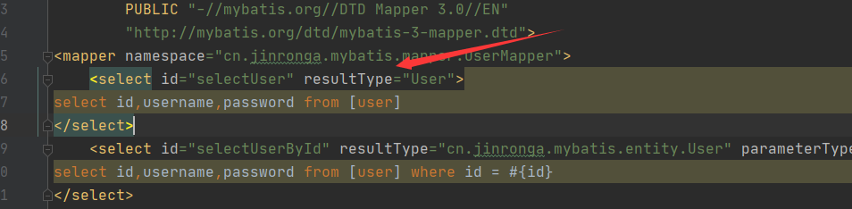

mybatis内置别名：


给实体类取别名：mybatis-config.xml添加 

```xml
　　<!-- 
        别名的第一种方式,为User类取别名
        这种方式比较直观，把一个type直接用短名字表示，这个配置是在mybatis的mybatis-config.xml里面配置的，在UserMapper.xml使用别名User就可以了

   -->
<typeAliases>
    <typeAlias type="cn.jinronga.mybatis.entity.User" alias="User"/>
</typeAliases>
```

```xml
    <select id="selectUser" resultType="User">
select id,username,password from [user]
</select>
```


resultType就可以改成User了



方式二：写一个报名默认类名就是别名不区分大小写

```xml
<typeAliases>
    <package name="cn.jinronga.mybatis.entity"/>
    　　　
</typeAliases>
```

package 标签 为某个包下的所有类起别名； name 属性填写包名。 别名默认是类名，不区分大小写如果要自定义：

```java
@Alias注解 加在实体类上，为某个类起别名；例：@Alias("User")
```

小结：map工作中及其常用，特别在多表查询中，字段又多又复杂。


##### resultMap详解

数据库不可能永远是你所想或所需的那个样子

属性名和字段名不一致，我们一般都会按照约定去设计数据的，但确实阻止不了一些孩子，瞎比起名字。


```xml
    <select id="selectUserById" resultType="cn.jinronga.mybatis.entity.User" parameterType="int">
select id,username,password from [user] where id = #{id}
</select>
```


测试：

```java
@Test
public void testSelectUserById() {
    UserMapper mapper = session.getMapper(UserMapper.class);
    User user = mapper.selectUserById(1);
    System.out.println(user);
}
```


name为null查询出来发现 name为空 . 说明出现了问题！

分析： select * from user where id = #{id} 可以看做 select id,username,password from user where id = #{id} mybatis会根据这些查询的列名(会将列名转化为小写,数据库不区分大小写) , 利用反射去对应的实体类中查找 相应列名的set方法设值 ，当然找不大username;

解决方案：

方案一：为列名指定别名 , 别名和java实体类的属性名一致 .

```xml
    <select id="selectUserById" resultType="cn.jinronga.mybatis.entity.User" parameterType="int">
select id,username as name,password from [user] where id = #{id}
</select>
```

方案二：使用结果集映射->ResultMap 【推荐】

```xml
<!--id为select中的resultMap的参数-->
<resultMap id="UserMap" type="User">
<!-- id为主键 -->
<id column="id" property="id"/>
<!-- column是数据库表的列名 , property是对应实体类的属性名 -->
<result column="username" property="name"/>
<result column="password" property="password"/>
</resultMap>

<select id="selectUserById" resultMap="UserMap">
select id , username , password from user where id = #{id}
</select>
```

结论：

这个地方我们手动调整了映射关系，称之为手动映射。 

但如果不调整呢？mybatis当然会按照约定自动映射。

> 当然约定的最基本的操作就是全都都一样，还有就是下划线和驼峰命名的自动转化

```xml
<settings>
<!--开启驼峰命名规则-->
<setting name="mapUnderscoreToCamelCase" value="true"/>
</settings>
```

