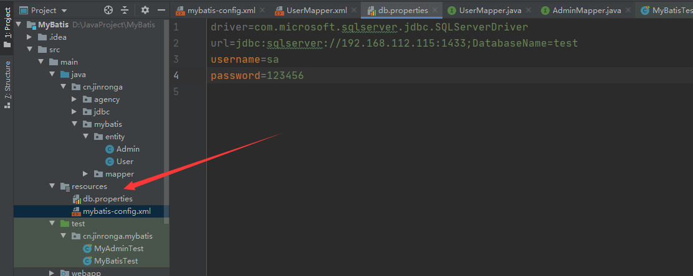

#### 五、配置文件解读

mybatis的配置文件分为核心配置文件和mapper配置文件

1、核心配置文件 mybatis-config.xml 系统核心配置文件 核心配置文件主要配置mybatis一些基础组件和加载资源，核心配置文件中的元素常常能影响mybatis的整个 运行过程。 能配置的内容如下，顺序不能乱：

```xml
1.properties是一个配置属性的元素
2.settings设置，mybatis最为复杂的配置也是最重要的，会改变mybatis运行时候的行为
3.typeAliases别名（在TypeAliasRegistry中可以看到mybatis提供了许多的系统别名）
4.typeHandlers 类型处理器（比如在预处理语句中设置一个参数或者从结果集中获取一个参数时候，都会用到类型
处理器，在TypeHandlerRegistry中定义了很多的类型处理器）
5.objectFactory 对象工厂（myabtis在构建一个结果返回的时候，会使用一个ObjectFactory去构建pojo)
6.plugins 插件
7.environments 环境变量
environment 环境变量
transactionManager 事务管理器
dataSource 数据源
databaseIdProvider 数据库厂商标识
8.mappers 映射器
```

environments元素

environments可以为mybatis配置多环境运行，将SQL映射到多个不同的数据库上，必须指定其中一个为默认运行 环境（通过default指定），如果想切换环境修改default的值即可。

最常见的就是，生产环境和开发环境，两个环境切换必将导致数据库的切换。

```xml
<environments default="development">
<environment id="development">
<transactionManager type="JDBC">
<property name="..." value="..."/>
</transactionManager>
<dataSource type="POOLED">
<property name="driver" value="${driver}"/>
<property name="url" value="${url}"/>
<property name="username" value="${username}"/>
<property name="password" value="${password}"/>
</dataSource>
</environment>
<environment id="product">
<transactionManager type="JDBC">
<property name="..." value="..."/>
</transactionManager>
<dataSource type="POOLED">
<property name="driver" value="${driver}"/>
<property name="url" value="${url}"/>
<property name="username" value="${username}"/>
<property name="password" value="${password}"/>
</dataSource>
</environment>
</environments>
```

dataSource 元素使用标准的 JDBC 数据源接口来配置 JDBC 连接对象的资源。

数据源是必须配置的。

 有三种内建的数据源类型

```
type="[UNPOOLED|POOLED|JNDI]"）
- unpooled：这个数据源的实现只是每次被请求时打开和关闭连接。
- pooled：这种数据源的实现利用“池”的概念将 JDBC 连接对象组织起来 , 这是一种使得并发 Web 应用快速
响应请求的流行处理方式。
- jndi：这个数据源的实现是为了能在如 Spring 或应用服务器这类容器中使用，容器可以集中或在外部配置数
据源，然后放置一个 JNDI 上下文的引用
```

数据源也有很多第三方的实现，比如druid，hikari，dbcp，c3p0等等.... 这两种事务管理器类型都不需要设置任何属性。 具体的一套环境，通过设置id进行区别，id保证唯一！ 子元素节点：transactionManager - [ 事务管理器]

```xml
<!-- 语法 -->
<transactionManager type="[ JDBC | MANAGED ]"/>
```

子元素节点：数据源（dataSource）

（2）mappers元素

>mappers的存在就是要对写好的mapper和xml进行统一管理 要不然系统怎么知道我写了哪些mapper

通常这么引入

```xml
<mappers>
    <mapper resource="cn/jinronga/mybatis/mapper/impl/UserMapper.xml"/>
    <mapper class="cn.jinronga.mybatis.mapper.AdminMapper"/>
</mappers>
```

Mapper文件

```
<?xml version="1.0" encoding="UTF-8" ?>
<!DOCTYPE mapper
        PUBLIC "-//mybatis.org//DTD Mapper 3.0//EN"
        "http://mybatis.org/dtd/mybatis-3-mapper.dtd">
<mapper namespace="cn.jinronga.mybatis.mapper.UserMapper">
....
</mapper>
```

- namespace中文意思：命名空间，作用如下：
-  namespace的命名必须跟某个接口同名，这才能找的到啊！

（3）Properties元素

数据库连接信息我们最好放在一个单独的文件中。

1、 在资源目录下新建一个db.properties



```properties
driver=com.microsoft.sqlserver.jdbc.SQLServerDriver
url=jdbc:sqlserver://192.168.112.115:1433;DatabaseName=test
username=sa
password=123456
```

2、 将mybatis-config.xml文件导入properties 配置文件

>    <properties resource="db.properties"/>

```xml
<configuration>
    <!--导入properties文件-->
    <properties resource="db.properties"/>
       <!--别名方式一：-->
       <typeAliases>
           <typeAlias type="cn.jinronga.mybatis.entity.User" alias="User"/>
       </typeAliases>
<!--    <settings>
        &lt;!&ndash;开启驼峰命名规则&ndash;&gt;
        <setting name="mapUnderscoreToCamelCase" value="true"/>
    </settings>-->
    <environments default="development">
        <environment id="development">
            <transactionManager type="JDBC"/>
            <dataSource type="POOLED">
                <property name="driver" value="${driver}"/>
                <property name="url" value="${url}"/>
                <property name="username" value="${username}"/>
                <property name="password" value="${password}"/>
            </dataSource>
        </environment>
    </environments>
    <mappers>
        <mapper resource="cn/jinronga/mybatis/mapper/impl/UserMapper.xml"/>
        <mapper class="cn.jinronga.mybatis.mapper.AdminMapper"/><!--注解-->
    </mappers>
</configuration>
```

（5）其他配置浏览

>settings能对我的一些核心功能进行配置，如懒加载、日志实现、缓存开启关闭等

>完整的 settings 元素：

```xml
settings>
<!---->
<setting name="cacheEnabled" value="true"/>
<!---->
<setting name="lazyLoadingEnabled" value="true"/>
<!---->
<setting name="multipleResultSetsEnabled" value="true"/>
<setting name="useColumnLabel" value="true"/>
<setting name="useGeneratedKeys" value="false"/>
<setting name="autoMappingBehavior" value="PARTIAL"/>
<setting name="autoMappingUnknownColumnBehavior" value="WARNING"/>
<setting name="defaultExecutorType" value="SIMPLE"/>
<setting name="defaultStatementTimeout" value="25"/>
<setting name="defaultFetchSize" value="100"/>
<setting name="safeRowBoundsEnabled" value="false"/>
<setting name="mapUnderscoreToCamelCase" value="false"/>
<setting name="localCacheScope" value="SESSION"/>
<setting name="jdbcTypeForNull" value="OTHER"/>
<setting name="lazyLoadTriggerMethods" value="equals,clone,hashCode,toString"/>
</settings>
```

