### springmvc案例（配置版）

##### 一、创建web工程项目：

新建maven工程

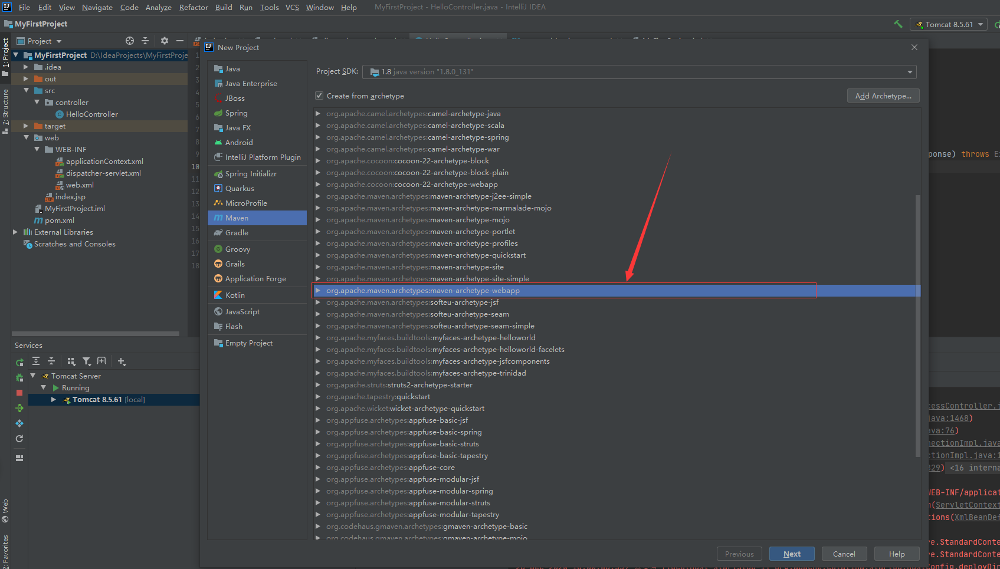

完善webapp工程必备目录

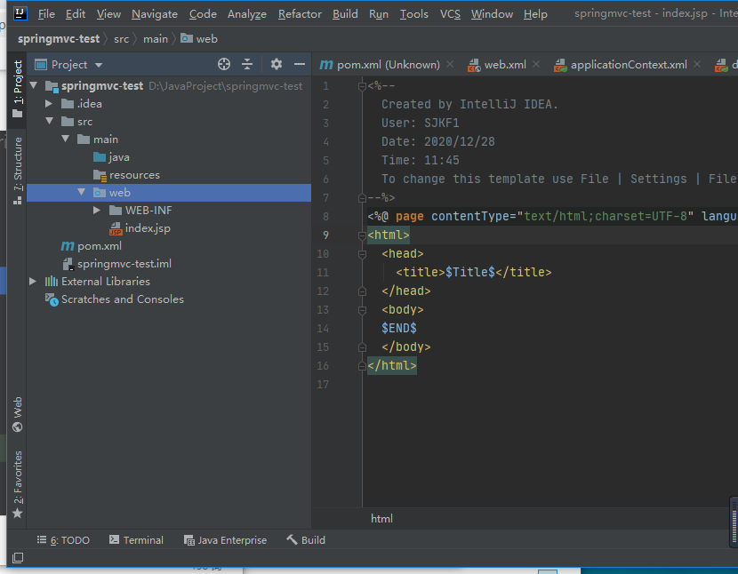

web.xml基本内容：

```xml
<?xml version="1.0" encoding="UTF-8"?>
<web-app xmlns="http://xmlns.jcp.org/xml/ns/javaee"
         xmlns:xsi="http://www.w3.org/2001/XMLSchema-instance"
         xsi:schemaLocation="http://xmlns.jcp.org/xml/ns/javaee
http://xmlns.jcp.org/xml/ns/javaee/web-app_4_0.xsd"
         version="4.0">


</web-app>
```


简单构建一下 

为的是idea能跑起来

 Facets表述了在Module中使用的各种各样的框架、技术和语言。这些Facets让Intellij IDEA知道怎么对待module 内容，并保证与相应的框架和语言保持一致。此处添加web项。注意配置。

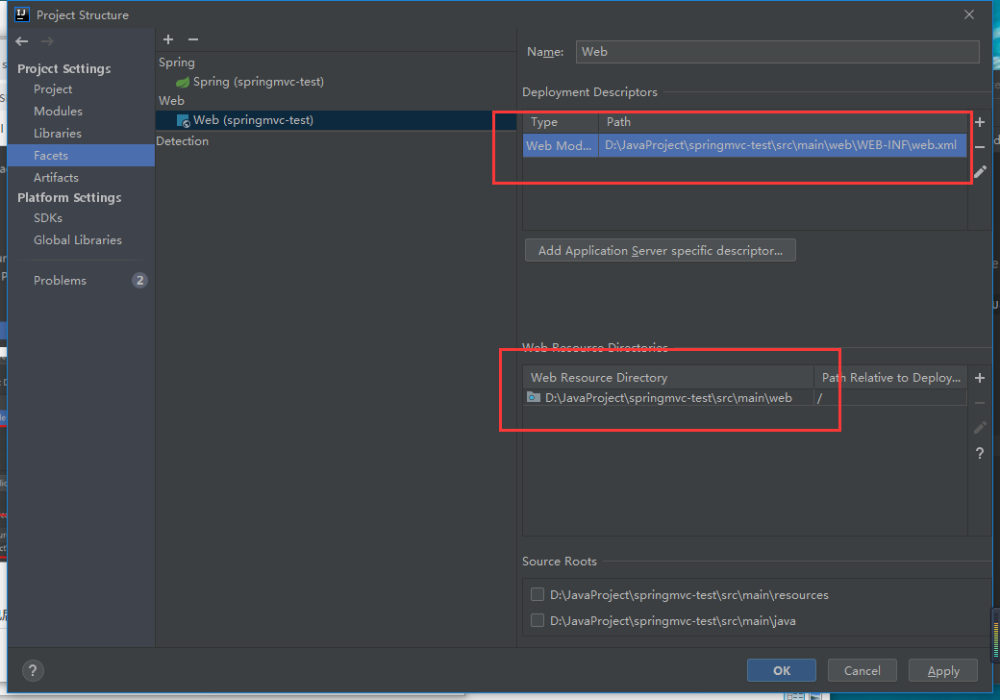

记得选对图上

增加打包方式，Exploded是不压缩方式，打包后是文件夹形式，使用此方式部署，可以进行热启动，修改class文 件和资源文件可以实时修改，但是Archive是打包后是真正的war包。

 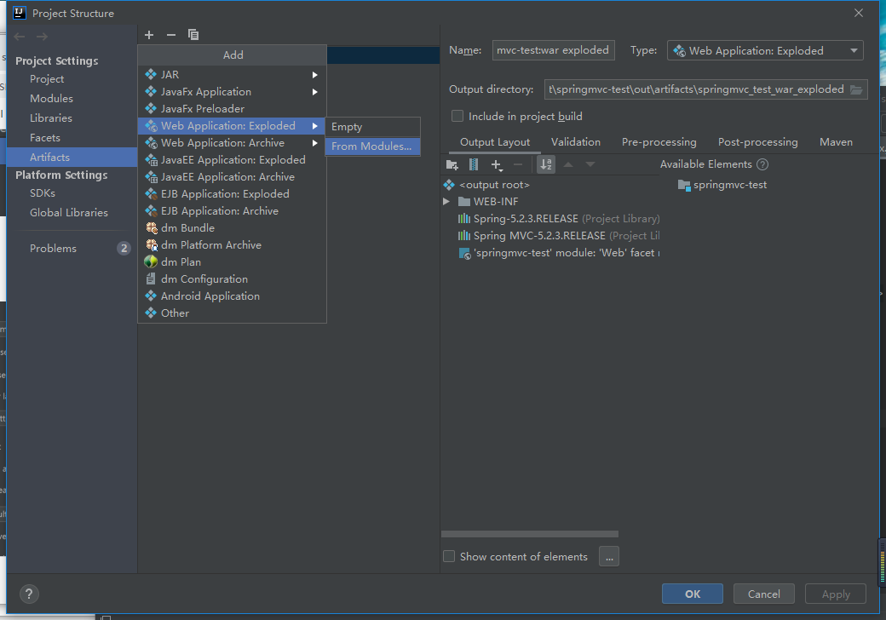

#### 2.配置tomcat：

第一步：

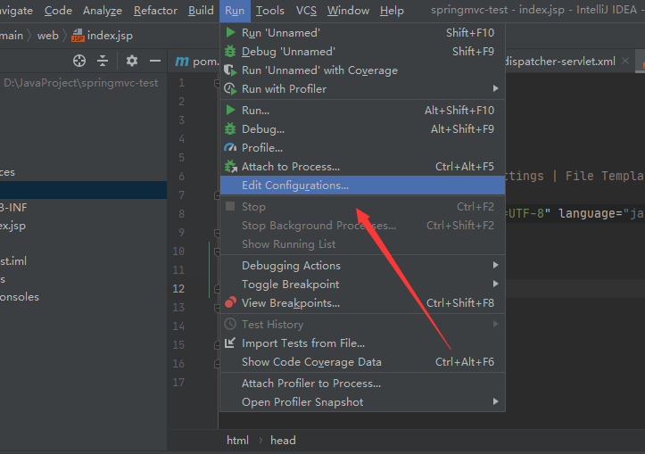

第二步：

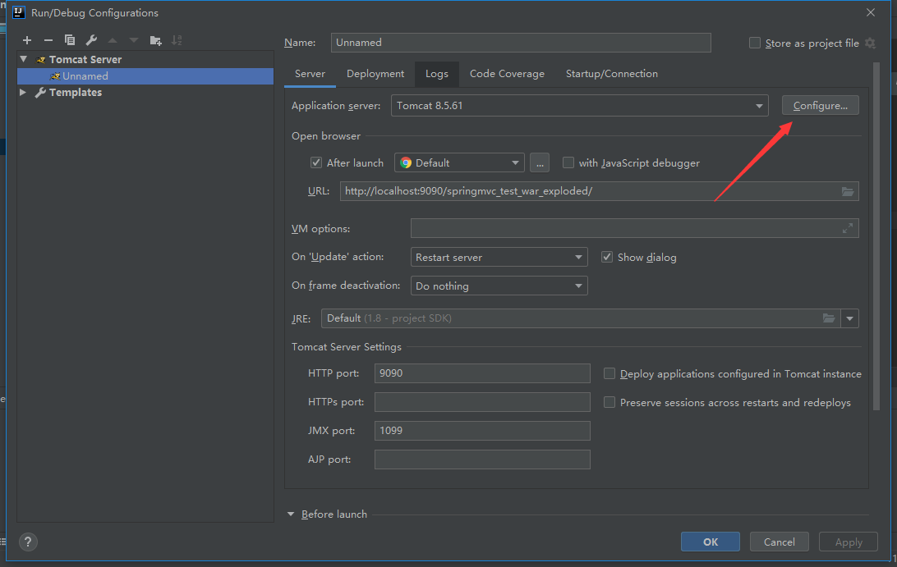

选择Tomcat的解压路径：

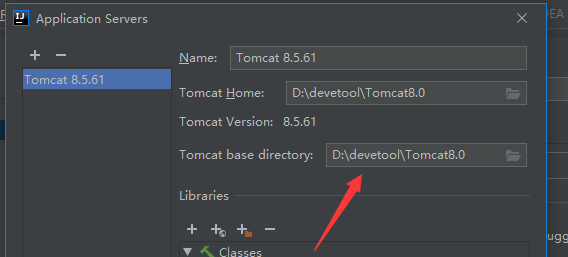

选择当前项目的war

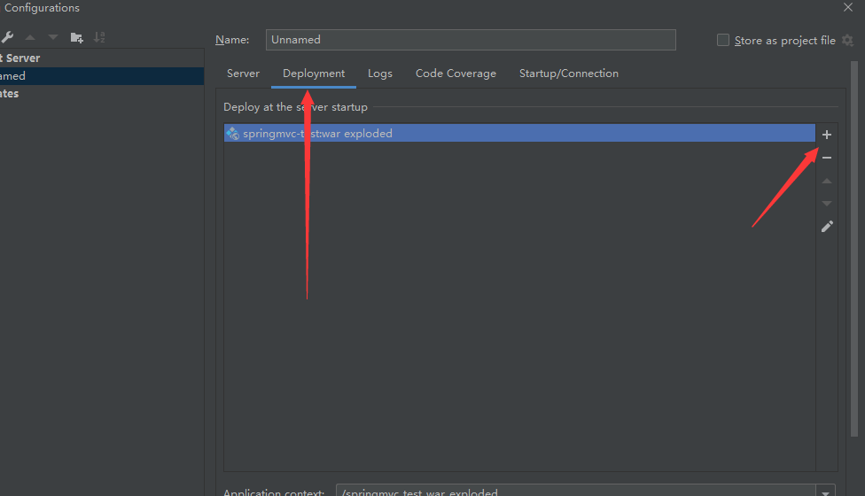

测试servlet：


```java
@WebServlet("/test")
public class TestServlet extends HttpServlet {

    @Override
    protected void doGet(HttpServletRequest req, HttpServletResponse resp) throws
            ServletException, IOException {
        resp.getWriter().println("hello servlet!！");
    }
}
```

启动tomcat

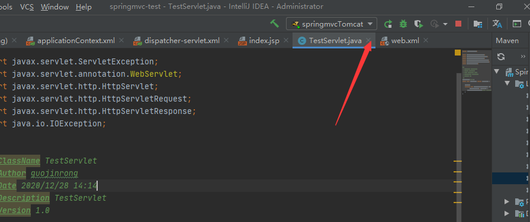

访问：http://localhost:9090/springmvc/test

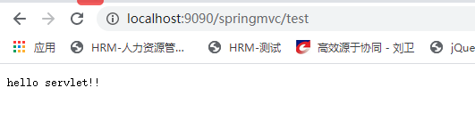

Tomcat配置成功！！！

#### 3.搭建springmvc环境

1.首先完整的pom

```xml
<?xml version="1.0" encoding="UTF-8"?>
<project xmlns="http://maven.apache.org/POM/4.0.0"
         xmlns:xsi="http://www.w3.org/2001/XMLSchema-instance"
         xsi:schemaLocation="http://maven.apache.org/POM/4.0.0 http://maven.apache.org/xsd/maven-4.0.0.xsd">
    <modelVersion>4.0.0</modelVersion>
    <groupId>cn.jinronga</groupId>
    <artifactId>spring-mvc-test</artifactId>
    <version>1.0.0</version>
    <packaging>war</packaging>
    <modules>
    </modules>

    <properties>
        <project.build.sourceEncoding>UTF-8</project.build.sourceEncoding>
        <java.version>1.8</java.version>
    </properties>
    <dependencies>
        <dependency>
            <groupId>junit</groupId>
            <artifactId>junit</artifactId>
            <version>4.12</version>
        </dependency>
        <dependency>
            <groupId>org.springframework</groupId>
            <artifactId>spring-webmvc</artifactId>
            <version>5.2.6.RELEASE</version>
        </dependency>
        <dependency>
            <groupId>javax.servlet</groupId>
            <artifactId>javax.servlet-api</artifactId>
            <version>4.0.0</version>
            <scope>provided</scope>
        </dependency>
        <dependency>
            <groupId>javax.servlet.jsp</groupId>
            <artifactId>jsp-api</artifactId>
            <version>2.2</version>
            <scope>provided</scope>
        </dependency>
    </dependencies>
    <build>
        <plugins>
            <plugin>
                <groupId>org.apache.maven.plugins</groupId>
                <artifactId>maven-compiler-plugin</artifactId>
                <version>3.1</version>

                <configuration>
                    <source>${java.version}</source> <!-- 源代码使用的JDK版本 -->
                    <target>${java.version}</target> <!-- 需要生成的目标class文件的编译版本-->
                    <encoding>${project.build.sourceEncoding}</encoding><!-- 字符集编码 -
-->
                </configuration>
            </plugin>
        </plugins>
        <resources>
            <resource>
                <directory>src/main/java</directory>
                <includes>
                    <include>**/*.properties</include>
                    <include>**/*.xml</include>
                </includes>
                <filtering>false</filtering>
            </resource>
            <resource>
                <directory>src/main/resources</directory>
                <includes>
                    <include>**/*.properties</include>
                    <include>**/*.xml</include>
                </includes>
                <filtering>false</filtering>
            </resource>
        </resources>
    </build>
</project>
```

2.配置web.xml

>注册DispatcherServlet(SpringMVC的核心需要重点学习！！！)

```xml
<?xml version="1.0" encoding="UTF-8"?>
<web-app xmlns="http://xmlns.jcp.org/xml/ns/javaee"
         xmlns:xsi="http://www.w3.org/2001/XMLSchema-instance"
         xsi:schemaLocation="http://xmlns.jcp.org/xml/ns/javaee http://xmlns.jcp.org/xml/ns/javaee/web-app_4_0.xsd"
         version="4.0">
    <!--注册DispatcherServlet，这是springmvc的核心，就是个servlet-->
    <servlet>
        <servlet-name>springmvc</servlet-name>
        <servlet-class>org.springframework.web.servlet.DispatcherServlet</servlet-class>
        <!--加载时先启动-->
        <load-on-startup>1</load-on-startup>
    </servlet>
    <!--/ 匹配所有的请求；（不包括.jsp）-->
    <!--/* 匹配所有的请求；（包括.jsp）-->
    <servlet-mapping>
        <servlet-name>springmvc</servlet-name>
        <url-pattern>/</url-pattern>
    </servlet-mapping>
</web-app>
```


3.编写配置文件 名称：springmvc-servlet.xml (其实就是个spring的配置文件) 写在/WEB-INF/下

```xml
<?xml version="1.0" encoding="UTF-8"?>
<beans xmlns="http://www.springframework.org/schema/beans"
       xmlns:xsi="http://www.w3.org/2001/XMLSchema-instance"
       xsi:schemaLocation="http://www.springframework.org/schema/beans http://www.springframework.org/schema/beans/spring-beans.xsd">
    <!-- 处理映射器 -->
    <bean class="org.springframework.web.servlet.handler.BeanNameUrlHandlerMapping"/>
    <!-- 处理器适配器 -->
    <bean class="org.springframework.web.servlet.mvc.SimpleControllerHandlerAdapter"/>
    <!--视图解析器:DispatcherServlet给他的ModelAndView-->
    <bean class="org.springframework.web.servlet.view.InternalResourceViewResolver"
          id="InternalResourceViewResolver">
        <!--前缀-->
        <property name="prefix" value="/WEB-INF/page/"/>
        <!--后缀-->
        <property name="suffix" value=".jsp"/>
    </bean>
</beans>
```

4、编写Controller 方式一：实现Controller接口 方式二：增加注解； 注意：需要返回一个ModelAndView，这个对象封装了视图和模型；

```java
public class FirstController implements Controller {
    public ModelAndView handleRequest(HttpServletRequest httpServletRequest,
                                      HttpServletResponse httpServletResponse) throws Exception {
        //ModelAndView 封装了模型和视图
        ModelAndView mv = new ModelAndView();
        //模型里封装数据
        mv.addObject("hellomvc", "Hello springMVC!");
        //封装跳转的视图
        mv.setViewName("hellomvc");
        //就是刚刚配置的试图解析器成果
        //这玩意就是为了省事的，自动给你加个前缀后缀
        //就成了 /jsp/hellomvc.jsp ---拼串
        return mv;
    }
}
```

5.controller注入容器 注意此时的id就成了你要访问的url了

```xml
<!--    配置FirstController    id就成了你要访问的url了-->
    <bean id="/hellomvc" class="cn.jinronga.test.contorller.FirstController"/>
```

6.创建jsp页面-- 使用el表达式获取模型数据

```html
<body>
${hellomvc}
</body>
```

**注：**测试抛异常

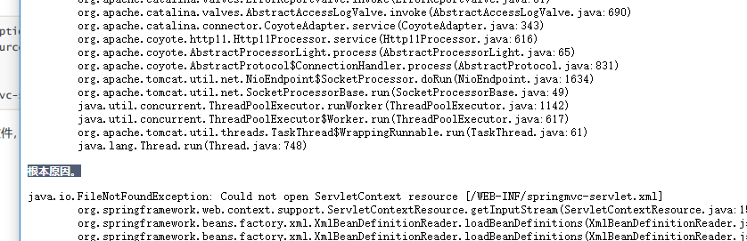

注意：springmvc默认回去找 /WEB-INF/spring-mvc-servlet.xml 这个文件，不去类路径找。 

**解决方法：**

方案一：

在 WEB-INF 建立 spring-mvc-servlet.xml 文件，名字不能错


方案二：指定加载文件

```xml
    <!--注册DispatcherServlet，这是springmvc的核心，就是个servlet-->
    <servlet>
        <servlet-name>springmvc</servlet-name>
        <servlet-class>org.springframework.web.servlet.DispatcherServlet</servlet-class>
        <init-param>
            <!--这里param-name 必须是contextConfigLocation 否则会抛出异常-->
            <param-name>contextConfigLocation</param-name>
            <param-value>classpath:spring-mvc-servlet.xml</param-value>
        </init-param>
        <!--加载时先启动-->
        <load-on-startup>1</load-on-startup>
    </servlet>
```

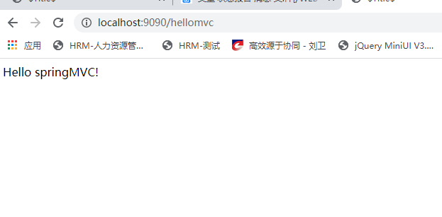

springmvc配置版就ok了