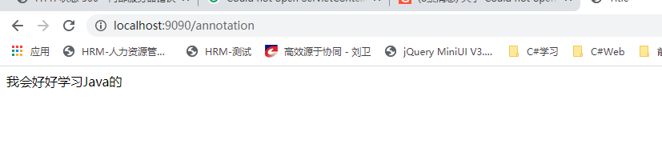

### 初识SpringMVC(注解版)

使用注解来一波   java开发不使用注解是没灵魂的，尤其还可以自定义注解。。。


**注意：**记住一点，只要用注解就得扫包，要不然鬼知道，哪个类有注解

```xml
<?xml version="1.0" encoding="UTF-8"?>
<beans xmlns="http://www.springframework.org/schema/beans"
       xmlns:xsi="http://www.w3.org/2001/XMLSchema-instance"
       xmlns:context="http://www.springframework.org/schema/context"
       xmlns:mvc="http://www.springframework.org/schema/mvc"
       xsi:schemaLocation="http://www.springframework.org/schema/beans http://www.springframework.org/schema/beans/spring-beans.xsd http://www.springframework.org/schema/context https://www.springframework.org/schema/context/spring-context.xsd http://www.springframework.org/schema/mvc https://www.springframework.org/schema/mvc/spring-mvc.xsd">
    <!-- 自动扫包 -->
    <context:component-scan base-package="cn.jinronga"/>
    <!-- 让Spring MVC不处理静态资源 -->
    <mvc:default-servlet-handler />
    <!-- 让springmvc自带的注解生效 -->
    <mvc:annotation-driven />
    <!-- 处理映射器 -->
    <bean class="org.springframework.web.servlet.handler.BeanNameUrlHandlerMapping"/>
    <!-- 处理器适配器 -->
    <bean class="org.springframework.web.servlet.mvc.SimpleControllerHandlerAdapter"/>
    <!--视图解析器:DispatcherServlet给他的ModelAndView-->
    <bean class="org.springframework.web.servlet.view.InternalResourceViewResolver"
          id="InternalResourceViewResolver">
        <!--前缀-->
        <property name="prefix" value="/WEB-INF/page/"/>
        <!--后缀-->
        <property name="suffix" value=".jsp"/>
    </bean>
</beans>
```

编写controller

```java
@Controller//这是一个控制器
public class AnnotationController {

    @RequestMapping("/annotation")  //或者@RequestMapping(value = "/annotation", method = RequestMethod.GET)
    public ModelAndView testAnnotation(){
        ModelAndView modelAndView = new ModelAndView();
            //模型里封装数据
        modelAndView.addObject("hello","我会好好学习Java的");
       //封装跳转的视图
        modelAndView.setViewName("annotation");
        return modelAndView;
    }

}
```

```html
${hello}
```


访问：http://localhost:9090/annotation



注解用起来是不是贼爽，这也是当今企业常用的。


如果有乱码：在web.xml中添加 统一字符集管理

```xml
    <filter>
        <filter-name>CharacterEncodingFilter</filter-name>
        <filter-class>org.springframework.web.filter.CharacterEncodingFilter</filter-class>
        <init-param>
            <param-name>encoding</param-name>
            <param-value>utf-8</param-value>
        </init-param>
    </filter>
    <filter-mapping>
        <filter-name>CharacterEncodingFilter</filter-name>
        <url-pattern>/*</url-pattern>
    </filter-mapping>
```

