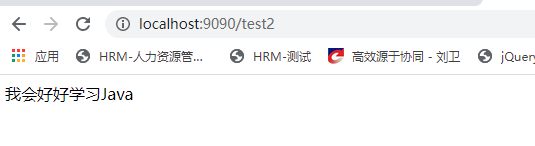
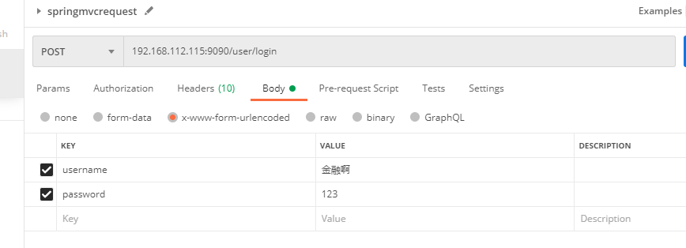
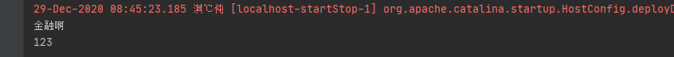
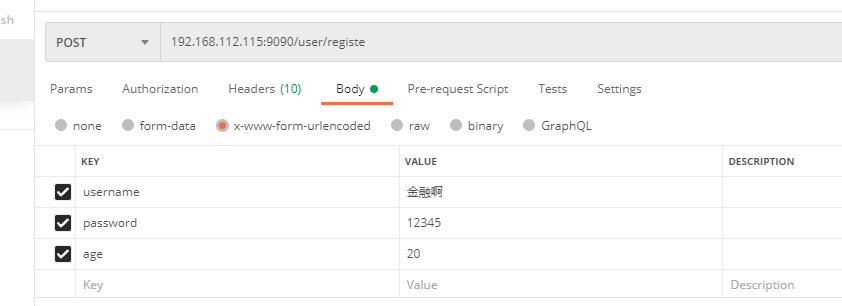
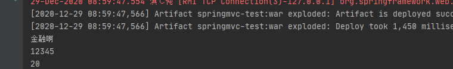
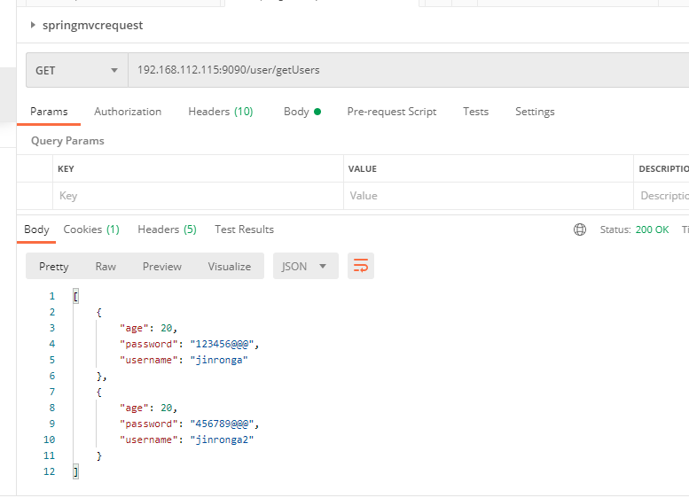
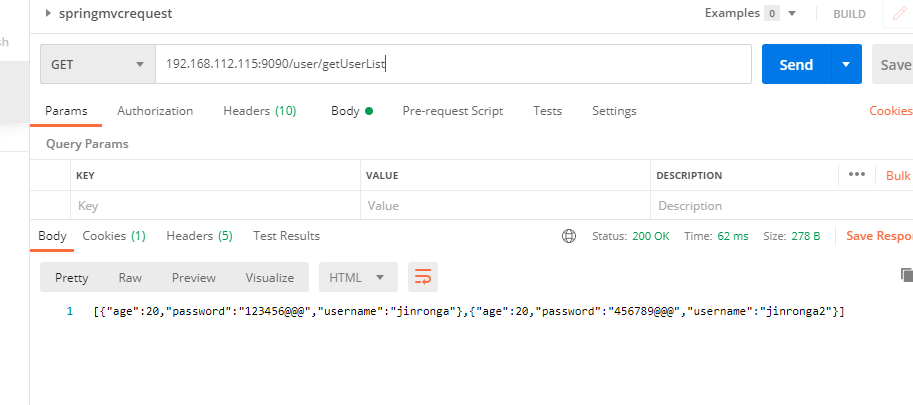

### springmvc深入学习

问题：所有的方法都返回ModelAndView是不是不太好？

视图和模型是两个东西，耦合在一起当然不好了，比如有时候我只是跳转视图，有时候压根不需要跳转视图，是不 是有更好的解决方案？

当然： 既然存在ModelAndView就应该存到Model和View。

**springMvc的解决方案是：**

- Model会在调用时通过参数形式传入。
- View可以简化为字符串形式返回。

如此解决才是企业常用的最优解。

##### 1、视图模型拆分案例

```java
/**
 * 方法二 解偶推荐使用
 */
@RequestMapping("/test")
public String test2Annotation(Model model){
    //添加模型
    model.addAttribute("hello","我会好好学习Java");
    //跳转到annotation视图
    return "annotation";
}
```

结果：



这才是最好的方法如果只需要处理model，则返回null，当然一般都会有数据传入 如果只处理view，则不用传入参数model


##### @RequestMapping 

@RequestMapping 这个注解很关键，可以方法类上也可以放在方法上。 如果放在类上，会给每个方法默认都加上，相当于本类全局前缀。

```java
@RequestMapping("user")
@Controller
public class AdvancedController {

    @RequestMapping("login")  //GET http://localhost/user/login
    public String login(){

        return "hellomvc";
    }
    
    @RequestMapping("registe")//GET http://localhost/user/registe
    public String registe(){
        return "hellomvc";
    }
}
```

**好处：** 一个类一般处理一类事物，可以统一加上前缀，好区分 简化书写复杂度

RequestMapping注解有六个属性。

 **1、 value ， method ：**

-  value： 指定请求的实际地址，指定的地址可以是URI Template 模式（后面将会说明）； 
- method： 指定请求的method类型， GET、POST、PUT、DELETE等；

2、consumes ， produces ：

- consumes： 指定处理请求的提交内容类型（Content-Type），例如application/json, text/html; 
- produces: 指定返回的内容类型，仅当request请求头中的(Accept)类型中包含该指定类型才返回,可以处理乱码

>@GetMapping(value = "{id}",produces = {"content-type:text/json;charset=utf-8"})

**3、 params ， headers:** 

- params： 指定request中必须包含某些参数值是，才让该方法处理。
-  headers： 指定request中必须包含某些指定的header值，才能让该方法处理请求。

##### 3、内置统一的字符集处理

> 在 web.xml 中配置一个字符集过滤器即可

```xml
<filter>
        <filter-name>CharacterEncodingFilter</filter-name>
        <filter-class>org.springframework.web.filter.CharacterEncodingFilter</filter-class>
        <init-param>
            <param-name>encoding</param-name>
            <param-value>utf-8</param-value>
        </init-param>
    </filter>
    <filter-mapping>
        <filter-name>CharacterEncodingFilter</filter-name>
        <url-pattern>/*</url-pattern>
    </filter-mapping>
```


##### 牛逼的传参：

```java
@RequestMapping("user")
@Controller
public class AdvancedController {

    @RequestMapping("login")
    public String login(String username,String password){
        System.out.println(username);
        System.out.println(password);
        return "hellomvc";
    }

    @RequestMapping("registe")
    public String registe(String username,String password){
        System.out.println(username);
        System.out.println(password);
        return "hellomvc";
    }
}
```


使用postmen模拟请求





问题：那么十几个请求参数表单参数怎么办？都在写在阐述？更牛的来了！

新建一个实体类对象User：

```java
public class User {
    private String username;
    private String password;
    private int age;

    public String getUsername() {
        return username;
    }

    public void setUsername(String username) {
        this.username = username;
    }

    public String getPassword() {
        return password;
    }

    public void setPassword(String password) {
        this.password = password;
    }

    public int getAge() {
        return age;
    }

    public void setAge(int age) {
        this.age = age;
    }
}
```

contorller：

```java
    @RequestMapping("registe")
    public String registe(User user) {
        System.out.println(user.getUsername());
        System.out.println(user.getPassword());
        System.out.println(user.getAge());
        return "hellomvc";
    }
```

postmen:







牛逼吧！

#### 返回json数据

我们经常需要使用ajax请求后台获取参数

最熟悉的fastjson（阿里巴巴的开源框架）

```xml
       <dependency>
            <groupId>com.alibaba</groupId>
            <artifactId>fastjson</artifactId>
            <version>1.2.68</version>
        </dependency>
```


```java
    @RequestMapping(value = "getUsers",produces = {"text/json;charset=utf-8"})
    @ResponseBody
    public String getUsers(){
        ArrayList<User> users = new ArrayList<>();
        User user1 = new User();
        user1.setUsername("jinronga");
        user1.setAge(20);
        user1.setPassword("123456@@@");
        User user2 = new User();
        user2.setUsername("jinronga2");
        user2.setAge(20);
        user2.setPassword("456789@@@");
        users.add(user1);
        users.add(user2);
        return JSONArray.toJSONString(users);
    }
```




成功！ **@ResponseBody**能将处理的结果放在响应体中，直接返回，不走视图解析器。

每次都需要自己处理数据麻烦 配置一下消息转换的bean

给容器注入一个消息转换的bean -spring-mvc-servlet.xml

```xml
<mvc:annotation-driven >
    <mvc:message-converters>
        <bean id="fastjson"
              class="com.alibaba.fastjson.support.spring.FastJsonHttpMessageConverter">
            <property name="supportedMediaTypes">
                <list>
                    <value>text/html;charset=UTF-8</value>
                    <value>application/json;charset=UTF-8</value>
                </list>
            </property>
        </bean>
    </mvc:message-converters>
</mvc:annotation-driven>
```

```java
    @RequestMapping("getUserList")
    @ResponseBody
    public List<User> getUserList(){
        ArrayList<User> users = new ArrayList<>();
        User user1 = new User();
        user1.setUsername("jinronga");
        user1.setAge(20);
        user1.setPassword("123456@@@");
        User user2 = new User();
        user2.setUsername("jinronga2");
        user2.setAge(20);
        user2.setPassword("456789@@@");
        users.add(user1);
        users.add(user2);

        return users;
    }
```




只要向容器注入一个用于转换的bean即可，除了fastjson还有jakson等