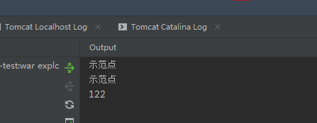
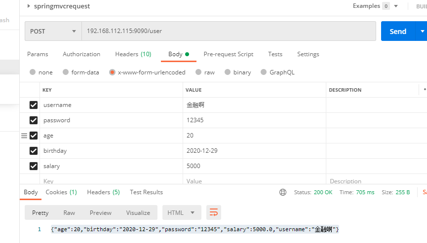
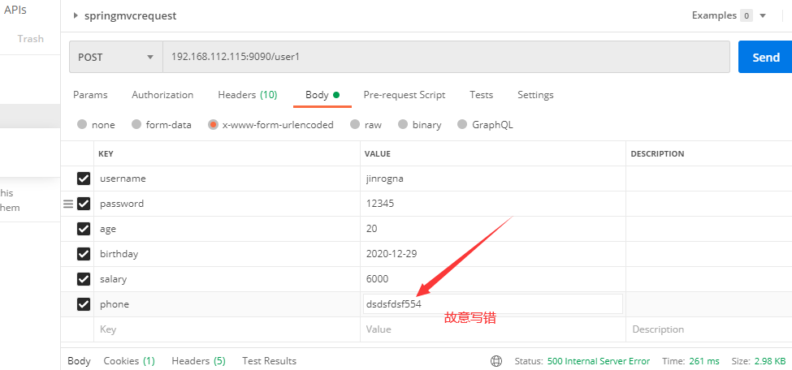
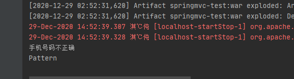

### SpringMvc获取请求内的json数据与数据转换数据校验


文章转自于：https://www.cnblogs.com/mmzuo-798/p/11634055.html

#### 定义和用法

enctype 属性规定在**发送到服务器之前**应该如何**对表单数据**进行**编码**。
默认地，表单数据会编码为 "application/x-www-form-urlencoded"。就是说，在发送到服务器之前，所有字符都会进行编码（空格转换为 "+" 加号，特殊符号转换为 ASCII HEX 值）。

#### enctype属性值

| **值**                            | 描述                                                         |
| --------------------------------- | ------------------------------------------------------------ |
| application/x-www-form-urlencoded | 在发送前编码所有字符（默认）                                 |
| multipart/form-data               | 不对字符编码。在使用包含文件上传控件的表单时，必须使用该值。 |
| text/plain                        | 空格转换为 "+" 加号，但不对特殊字符编码。                    |

[HTTP/1.1 协议](http://www.ietf.org/rfc/rfc2616.txt)规定的 HTTP 请求方法有 OPTIONS、GET、HEAD、POST、PUT、DELETE、TRACE、CONNECT 这几种。
其中 POST 一般用来向服务端提交数据，本文主要讨论 POST 提交数据的几种方式。

#  

我们知道，HTTP 协议是以 **ASCII 码**传输，建立在 TCP/IP 协议之上的应用层规范。
规范把 HTTP 请求分为三个部分：状态行、请求头、消息主体。类似于下面这样：

协议规定 POST 提交的数据必须放在消息主体（entity-body）中，但协议并没有规定数据必须**使用什么编码方式**。实际上，开发者完全可以自己决定消息主体的格式，只要最后发送的 HTTP 请求满足上面的格式就可以。

但是，数据发送出去，还要服务端解析成功才有意义。一般服务端语言如 php、python 等，以及它们的 framework，都内置了自动解析常见数据格式的功能。
服务端通常是根据请求头（headers）中的 **Content-Type** 字段来获知请求中的消息主体是用何种方式编码，再对主体进行解析。
所以说到 POST 提交数据方案，包含了 Content-Type 和消息主体编码方式两部分。
下面就正式开始介绍它们。


##### application/x-www-form-urlencoded

这应该是最常见的 POST 提交数据的方式了。浏览器的原生 <form> 表单，如果**不设置 `enctype` 属性**，那么最终就会以 application/x-www-form-urlencoded 方式提交数据。

```java
    @PostMapping(value = "/registe")
    public String registe(User user) {
        System.out.println(user.getUsername());
        System.out.println(user.getPassword());
        System.out.println(user.getAge());
        return "hellomvc";
    }
```


```
<%@ page language="java" contentType="text/html; charset=UTF-8"
         pageEncoding="UTF-8" import="java.util.*" isELIgnored="false" %>
<html>
<head>
    <title>$Title$</title>
</head>
<body>
<form action="user/registe"  method="post">

    名称 ：<input type="text" name="username" value=""><br/>
    账号： <input type="text" name="password" value=""><br/>
    年龄： <input type="text" name="age" value=""><br/>
    <input type="submit" value="提交">
</form>
</body>
</html>
```



7、数据转化 

在我们传递表单参数时，表单输入的都是字符串，但是一些简单的转化他居然能自行完成？

修改User实体类注意要生成getset方法

```java
public class User {
    private String username;
    private String password;
    private int age;
    @DateTimeFormat(pattern = "yyy-MM-dd")
    private String birthday;
    //注意：真正开发不会这样用！！！ BigDecimal使用定义
    @NumberFormat(pattern = "#,###,###.#")
    private Double salary;
    }
```

contorller:

```java
@RestController //@RestController 是@Controller与@ResponseBody结合
public class UserController {

    @PostMapping("/user")
    public User user(User user) {
        return user;
    }
}
```





#### 数据校验 

JSR 303 :

JSR 303 是 Java 为 Bean 数据合法性校验提供的标准框架，它已经包含在 JavaEE 6.0 中 JSR 303 通过在 Bean 属性 上标注类似于 @NotNull、@Max 等标准的注解指定校验规则，并通过标准的验证接口对 Bean 进行验证

**使用数据校验，可以保证数据的正确性；**

常见参数：

```java
@NotNull(message="名字不能为空")
private String userName;
@Max(value=120,message="年龄最大不能查过120")
private int age;
@Email(message="邮箱格式错误")
private String email;

空检查
@Null       验证对象是否为null
@NotNull    验证对象是否不为null, 无法查检长度为0的字符串
@NotBlank   检查约束字符串是不是Null还有被Trim的长度是否大于0,只对字符串,且会去掉前后空格.
@NotEmpty   检查约束元素是否为NULL或者是EMPTY.
    
Booelan检查
@AssertTrue     验证 Boolean 对象是否为 true  
@AssertFalse    验证 Boolean 对象是否为 false  
    
长度检查
@Size(min=, max=) 验证对象（Array,Collection,Map,String）长度是否在给定的范围之内  
@Length(min=, max=) string is between min and max included.

日期检查
@Past       验证 Date 和 Calendar 对象是否在当前时间之前  
@Future     验证 Date 和 Calendar 对象是否在当前时间之后  
@Pattern    验证 String 对象是否符合正则表达式的规则
数值检测
@MIn 验证数字是否大于等于指定的值
@Max 验证数字是否小于等于指定的值
@Digits 验证数字是否符合指定格式
@Range 验证数字是否在指定的范围内
其他
@Email 验证是否为邮件格式
@Pattern 验证String对象是否正则规则
 
MVC中使用@Validated即可触发一次校验
校验结果存放在 BindingResult 对象中
```

Hibernate Validator 扩展注解

 Hibernate Validator 是 JSR 303 的一个参考实现，除支持所有标准的校验注解外，它还支持以下的扩展注解 Hibernate Validator 附加的 constraint

| Constraint | 详细信息                               |
| ---------- | -------------------------------------- |
| @Email     | 被注释的元素必须是电子邮箱地址         |
| @Length    | 被注释的字符串的大小必须在指定的范围内 |
| @NotEmpty  | 被注释的字符串的必须非空               |
| @Range     | 被注释的元素必须在合适的范围内         |

**Spring MVC 数据校验**

Spring MVC 除了会将表单/命令对象的校验结果保存到对应的 BindingResult 或 Errors 对象中外，还会将所有校 验结果保存到 “隐含模型” 即使处理方法的签名中没有对应于表单/命令对象的结果入参，校验结果也会保存在 “隐含 对象” 中。 隐含模型中的所有数据最终将通过 HttpServletRequest 的属性列表暴露给 JSP 视图对象，因此在 JSP 中可以获取错误信息

案例：

引入jar包

```xml
<dependency>
<groupId>org.hibernate</groupId>
<artifactId>hibernate-validator</artifactId>
<version>6.0.9.Final</version>
</dependency>
```

实体类加注解User

```java
public class User {
    @NotEmpty(message = "姓名不能为空")
    private String username;

    private String password;
    @Min(value = 0, message = "年龄不能小于{value}")
    @Max(value = 120,message = "年龄不能大于{value}")
    private int age;
    @DateTimeFormat(pattern = "yyyy-MM-dd")
    private String birthday;
    //注意：真正开发不会这样用！！！ BigDecimal使用定义
    @NumberFormat(pattern = "#,###,###.#")
    private Double salary;

    @Pattern(regexp = "^1([358][0-9]|4[579]|66|7[0135678]|9[89])[0-9]{8}$", message =
            "手机号码不正确")
    private String phone;
    }
```

spring-mvc-servlet.xml配置：

```xml
    <bean id="beacon1024Validator"
          class="org.springframework.validation.beanvalidation.LocalValidatorFactoryBean">
        <property name="providerClass" value="org.hibernate.validator.HibernateValidator"/>
    </bean>
    <!--注册注解驱动-->
    <mvc:annotation-driven validator="beacon1024Validator"/>
```

contorller:

```java
@RestController //@RestController 是@Controller与@ResponseBody结合
public class UserController {

    @PostMapping("/user1")
    public void testAnnotation(@Validated User user, BindingResult br) {
        List<ObjectError> allErrors = br.getAllErrors();
        for (ObjectError error : allErrors) {
            System.out.println(error.getDefaultMessage());
            System.out.println(error.getCode());
        }
//验证有错误直接返回
        if (allErrors.size() > 0) {
            return;
        }
        System.out.print(user);
    }
}
```


测试：



结果：



注意：

永远不要相信用户的输入，我们开发的系统凡是涉及到用户输入的地方，都要进行校验，这里的校验分为前台校验 和后台校验，前台校验通常由javascript来完成，后台校验主要由java来负责，这里我们可以通过spring mvc+hibernate validator完成。