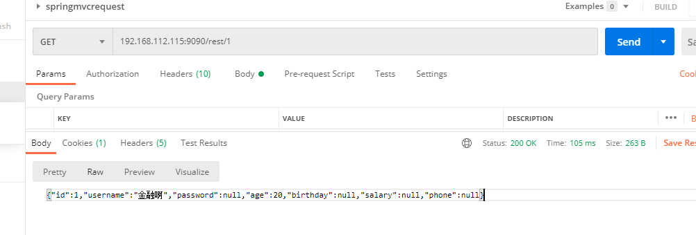

### springmvc-restful-ajax与拦截器

自从Roy Fielding博士在2000年他的博士论文中提出REST（Representational State Transfer）风格的软件架构模 式后，REST就基本上迅速取代了复杂而笨重的SOAP，成为Web API的标准了。

restful是一种风格，可以遵循，也可以不遵循，但是正在慢慢变成主流

1、Rest架构的主要原则

-  网络上的所有事物都被抽象为资源 
- 每个资源都有一个唯一的资源标识符
-  同一个资源具有多种表现形式(xml,json)等 
- 对资源的各种操作不会改变资源标识符 
- 所有的操作都是无状态的 符合REST原则的架构方式即可称为RESTful

| 请求url | 请求方式 | 操作                |
| ------- | -------- | ------------------- |
| /user/1 | get      | 获取一个id为1的user |
| /user/1 | delete   | 删除id为1的对象     |
| ser/1   | put      | 更新id为1的对象     |
| /user   | post     | 新增一个对象        |

Spring MVC 对 RESTful应用提供了以下支持

- 利用@RequestMapping 指定要处理请求的URI模板和HTTP请求的动作类型 
- 利用@PathVariable讲URI请求模板中的变量映射到处理方法参数上
-  利用Ajax,在客户端发出PUT、DELETE动作的请求

**3、RequestMapping中的rest**

```java
@RequestMapping(value = "/{id}", method = RequestMethod.GET)
@RequestMapping(value = "/add", method = RequestMethod.POST)
@RequestMapping(value = "/{id}", method = RequestMethod.DELETE)
@RequestMapping(value = "/{id}", method = RequestMethod.PUT)
```

还有更好用的 获取请求url模板中的变量方法

```
@GetMapping("/user/{id}")
@PostMapping("/user")
@DeleteMapping("/user/{id}")
@PutMapping("/user/{id}")
```

```xml
        <dependency>
            <groupId>com.fasterxml.jackson.core</groupId>
            <artifactId>jackson-databind</artifactId>
            <version>2.9.1</version>
        </dependency>
```


接着在spring-mvc-servlet.xml配置文件中添加如下配置，指定Message对象转换器：

```xml
<mvc:annotation-driven>
    <mvc:message-converters>
        <bean class="org.springframework.http.converter.StringHttpMessageConverter"/>
        <bean class="org.springframework.http.converter.json.MappingJackson2HttpMessageConverter"/>
    </mvc:message-converters>
</mvc:annotation-driven>
```

案例：

> 定制统一返回类型

**注意：**全部属性要生成getset方法

```java
public class R implements Serializable {
    private int code;
    private String msg;
    private Map<String,Object> data;
    private R(int code, String msg, Map<String, Object> data) {
        this.code = code;
        this.msg = msg;
        this.data = data;
    }
    //成功的返回
    public static R success(){
        return new R(200,"操作成功",null);
    }
    //失败的返回
    public static R fail(){
        return new R(500,"操作失败",null);
    }
    //其他类型的返回
    public static R build(int code,String msg){
        return new R(500,msg,null);
    }
    public R put(String key,Object msg){
        if(this.getData() == null){
            this.setData(new HashMap<>(16));
        }
        this.getData().put(key,msg);
        return this;
    }
}
```

controller：

```java
@Controller 
public class UserController {

    @GetMapping("/rest/{id}")
    @ResponseBody
    public User getUser(@PathVariable int id){
        System.out.println(id);
        //....
        User user = new User();
        user.setUsername("金融啊");
        user.setAge(20);
        user.setId(id);

        return user;
    }
    @DeleteMapping("/rest/{id}")
    @ResponseBody
    public R deleteUser(@PathVariable int id){
        System.out.println(id);
        //....
        return R.success();
    }

    @PostMapping("/rest/{id}")
    @ResponseBody
    public R updateUser(@PathVariable int id,User user){
        System.out.println(id);
        System.out.println(user);
        //...
        return R.fail();
    }
    @PostMapping("/rest/add")
    @ResponseBody
    public R addrUser(User user){
        System.out.println(user);
        return R.build(304,"插入发生异常").put("reason","超时了")
                .put("other","金融融融融果果");
    }
}
```





其他自行测试注意传递参数！


##### 4、ajax还能这么玩 

可以采用Ajax方式发送PUT和DELETE请求


```
$.ajax( {
type : "GET",
url : "http://localhost:8080/springmvc/user/rest/1",
dataType : "json",
success : function(data) {
console.log("get请求！---------------------")
console.log(data)
}
});
$.ajax( {
type : "DELETE",
url : "http://localhost:8080/springmvc/user/rest/1",
dataType : "json",
success : function(data) {
console.log("delete请求！---------------------")
console.log(data)
}
});
$.ajax( {
type : "put",
url : "http://localhost:9090/springmvc/user/rest/1",
dataType : "json",
data: {id:12,username:"金融融融融果果",password:"123"},
success : function(data) {
console.log("get请求！---------------------")
console.log(data)
}
});
$.ajax( {
type : "post",
url : "http://localhost:9090/springmvc/user/rest",
dataType : "json",
data: {id:12,username:"金融融融融果果",password:"123"},
success : function(data) {
console.log("get请求！---------------------")
console.log(data)
}
});
```


##### 拦截器：

拦截器规则 ：

我们可以配置多个拦截器，每个拦截器中都有三个方法。下面将总结多个拦截器中的方法执行规律。 1. preHandle：Controller方法处理请求前执行，根据拦截器定义的顺序，正向执行。

2.postHandle：Controller方法处理请求后执行，根据拦截器定义的顺序，逆向执行。需要所有的preHandle方 法都返回true时才会调用。

3.afterCompletion：View视图渲染后处理方法：根据拦截器定义的顺序，逆向执行。preHandle返回true就会 调用。

```java
/**
 * 登录拦截器
 */
public class LoginInterceptor implements HandlerInterceptor {
    /**
     * 在执行Controller方法前拦截，判断用户是否已经登录，
     * 登录了就放行，还没登录就重定向到登录页面
     */
    @Override
    public boolean preHandle(HttpServletRequest request, HttpServletResponse response,
                             Object handler) throws IOException {
        HttpSession session = request.getSession();
        User user = (User) session.getAttribute("user");
        if (user == null) {
//还没登录，重定向到登录页面
            response.sendRedirect("/toLogin");
        }
//已经登录，放行
        return true;
        
    }

    @Override
    public void postHandle(HttpServletRequest request, HttpServletResponse response,
                           Object handler, ModelAndView modelAndView) {
    }

    @Override
    public void afterCompletion(HttpServletRequest request, HttpServletResponse
            response, Object handler, Exception ex) {
    }
}
```

编写完SpringMVC拦截器，

我们还需要在spring-mvc-servlet.xml配置文件中，配置我们编写的拦截器，配置代码如下：

1. 配置需要拦截的路径 
2. 配置不需要拦截的路径 
3.  配置我们自定义的拦截器类

```xml
    <mvc:interceptors>
        <mvc:interceptor>
            <!--
            mvc:mapping：拦截的路径
            /**：是指所有文件夹及其子孙文件夹
            /*：是指所有文件夹，但不包含子孙文件夹
            /：Web项目的根目录
            -->
            <mvc:mapping path="/**"/>
            <!--
            mvc:exclude-mapping：不拦截的路径,不拦截登录路径
            /toLogin：跳转到登录页面
            /login：登录操作
            -->
            <mvc:exclude-mapping path="/toLogin"/>
            <mvc:exclude-mapping path="/login"/>
            <!--class属性就是我们自定义的拦截器-->
            <bean id="loginInterceptor"
                  class="cn.jinronga.test.Interceptor.LoginInterceptor"/>
        </mvc:interceptor>
    </mvc:interceptors>
```

编写SpringMVC配置类，将自定义拦截器添加到配置中:


扩展：在springboot中已经全面使用配置类进行配置了

```java
@Configuration
public class WebMvcConfig extends WebMvcConfigurerAdapter {
@Override
public void addInterceptors(InterceptorRegistry registry) {
//创建自定义的拦截器
Interceptor interceptor = new LoginInterceptor();
//添加拦截器
registry.addInterceptor(interceptor)
//添加需要拦截的路径
.addPathPatterns("");
}
}
```

