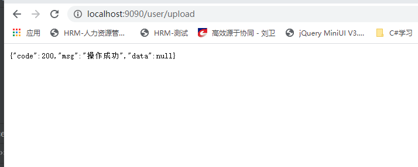
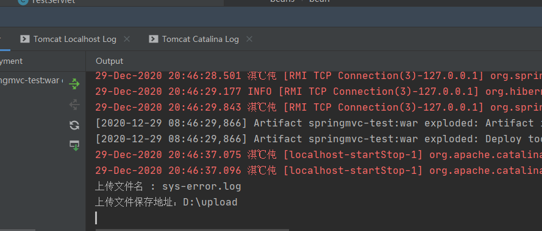
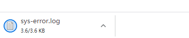

### 七、文件上传


 MultipartResolver 用于处理文件上传，当收到请求时 DispatcherServlet 的 checkMultipart() 方法会调用 MultipartResolver 的 isMultipart() 方法判断请求中是否包含文件。如果请求数据中包含文件，则调用 MultipartResolver 的 resolveMultipart() 方法对请求的数据进行解析，然后将文件数据解析成 MultipartFile 并封 装在 MultipartHttpServletRequest (继承了 HttpServletRequest) 对象中，最后传递给 Controller。

 MultipartResolver 默认不开启，需要手动开启。

 前端表单要求：为了能上传文件，必须将表单的method设置为POST，并将enctype设置为multipart/form-data。 只有在这样的情况下，浏览器才会把用户选择的文件以二进制数据发送给服务器； 对表单中的 enctype 属性做个详细的说明： application/x-www-form-urlencoded：默认方式，只处理表单域中的 value 属性值，采用这种编码方式的表 单会将表单域中的值处理成 URL 编码方式。 multipart/form-data：这种编码方式会以二进制流的方式来处理表单数据，这种编码方式会把文件域指定文 件的内容也封装到请求参数中，不会对字符编码。

```html
<form action="" enctype="multipart/form-data" method="post">
    <input type="file" name="file"/>
    <input type="submit">
</form>
```

> 文件上传

1、导入文件上传的jar包，commons-fileupload ， Maven会自动帮我们导入他的依赖包 commons-io包；

```xml
<!--文件上传-->
<dependency>
<groupId>commons-fileupload</groupId>
<artifactId>commons-fileupload</artifactId>
<version>1.3.3</version>
</dependency>
```

2、配置bean：multipartResolver 【注意！！！这个bena的id必须为：multipartResolver ， 否则上传文件会报400的错误！在这里栽过坑,教 训！】

```xml
<!--文件上传配置-->
<bean id="multipartResolver"
      class="org.springframework.web.multipart.commons.CommonsMultipartResolver">
    <!-- 请求的编码格式，必须和jSP的pageEncoding属性一致，以便正确读取表单的内容，默认为ISO-8859-1
    -->
    <property name="defaultEncoding" value="utf-8"/>
    <!-- 上传文件大小上限，单位为字节（10485760=10M） -->
    <property name="maxUploadSize" value="10485760"/>
    <property name="maxInMemorySize" value="40960"/>
</bean>
```

CommonsMultipartFile 的 常用方法：

-  String getOriginalFilename()：获取上传文件的原名
-  InputStream getInputStream()：获取文件流 
- void transferTo(File dest)：将上传文件保存到一个目录文件中

3、编写前端页面

```html
<form action="/upload" enctype="multipart/form-data" method="post">
    <input type="file" name="file"/>
    <input type="submit" value="upload">
</form>
```

controller：

```java
    /**
     * 文件上传
     */
    @PostMapping("/upload")
    @ResponseBody
    public R upload(@RequestParam("file") CommonsMultipartFile file, HttpServletRequest
            request) throws Exception {
//获取文件名 : file.getOriginalFilename();
        String uploadFileName = file.getOriginalFilename();
        System.out.println("上传文件名 : " + uploadFileName);
//上传路径保存设置
        String path = "D:/upload";
//如果路径不存在，创建一个
        File realPath = new File(path);
        if (!realPath.exists()) {
            realPath.mkdir();
        }
        System.out.println("上传文件保存地址：" + realPath);
//写读流一样
        file.transferTo(new File(path + "/" + uploadFileName));
        return R.success();
    }
```

上传成功！！







文件下载：

第一种可以直接向response的输出流中写入对应的文件流

 第二种可以使用 ResponseEntity来向前端返回文件

```java
 /**
     * 文件下载
     */
    @GetMapping("/download1")
    @ResponseBody
    public R download1(HttpServletResponse response) {

        FileInputStream fileInputStream = null;
        ServletOutputStream outputStream = null;
        try {
//以文件形式下载
            String fileName = "sys-error.log";
//1、设置response 响应头，处理中文名字乱码问题
            response.reset(); //设置页面不缓存,清空buffer
            response.setCharacterEncoding("UTF-8"); //字符编码
            response.setContentType("multipart/form-data"); //二进制传输数据
//设置响应头
            response.setHeader("Content-Disposition",
                    "attachment;fileName=" + URLEncoder.encode(fileName, "UTF-8"));
            File file = new File("D:/upload/" + fileName);
            fileInputStream = new FileInputStream(file);
            outputStream = response.getOutputStream();
            byte[] buffer = new byte[1024];
            int len;
            while ((len = fileInputStream.read(buffer)) != -1) {
                outputStream.write(buffer, 0, len);
                outputStream.flush();
            }
            return R.success();
        } catch (IOException e) {
            e.printStackTrace();
            return R.fail();
        } finally {
            if (fileInputStream != null) {
                try {
                    fileInputStream.close();
                } catch (IOException e) {
                    e.printStackTrace();
                }
            }
            if (outputStream != null) {
                try {
                    outputStream.close();
                } catch (IOException e) {
                    e.printStackTrace();
                }
            }
        }
    }
```





二、使用ResponseEntity

推荐使用这种方式，这种方式可以以json形式给前台返回提示信息。

```java
@GetMapping("/download2")
public ResponseEntity<byte[]> download2(){
    try {
        String fileName = "sys-error.log";
        byte[] bytes = FileUtils.readFileToByteArray(new File("D:/upload/"+fileName));
        HttpHeaders headers=new HttpHeaders();
        headers.set("Content-Disposition","attachment;filename="+
                URLEncoder.encode(fileName, "UTF-8"));
        headers.set("charsetEncoding","utf-8");
        headers.set("content-type","multipart/form-data");
        ResponseEntity<byte[]> entity=new ResponseEntity<>(bytes,headers,
                HttpStatus.OK);
        return entity;
    } catch (IOException e) {
        e.printStackTrace();
        return null;
    }
}
```


